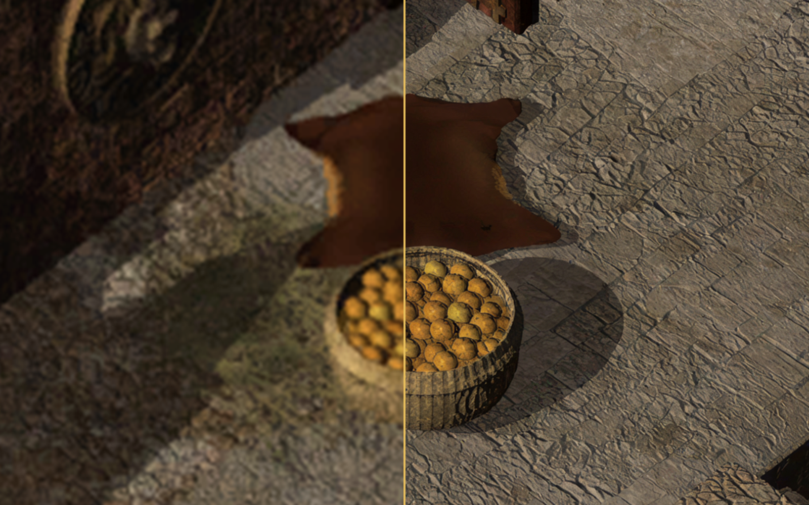
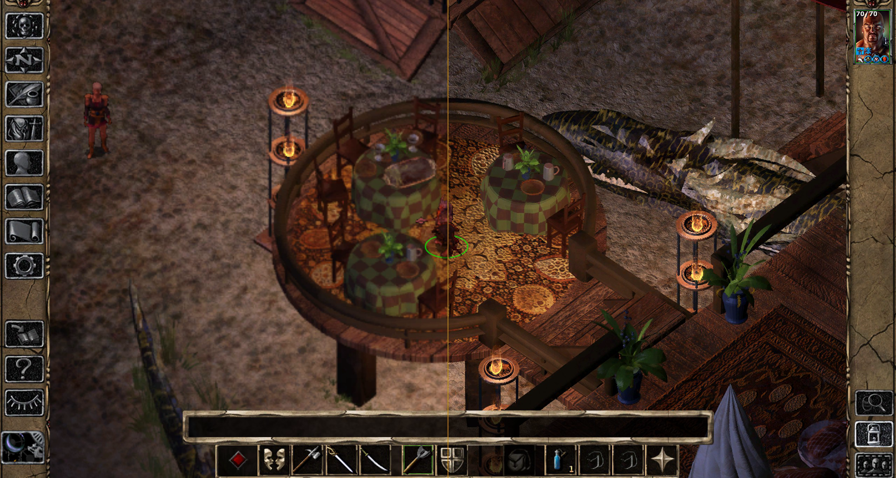
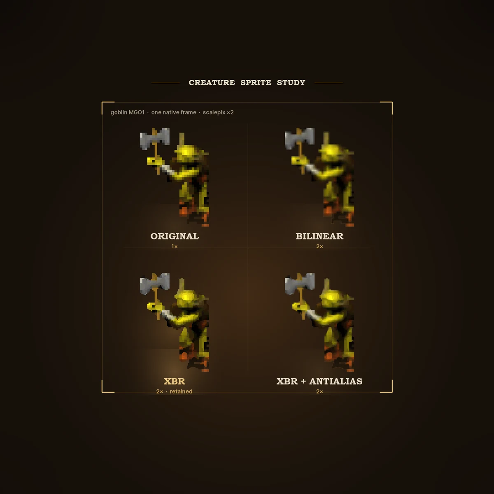
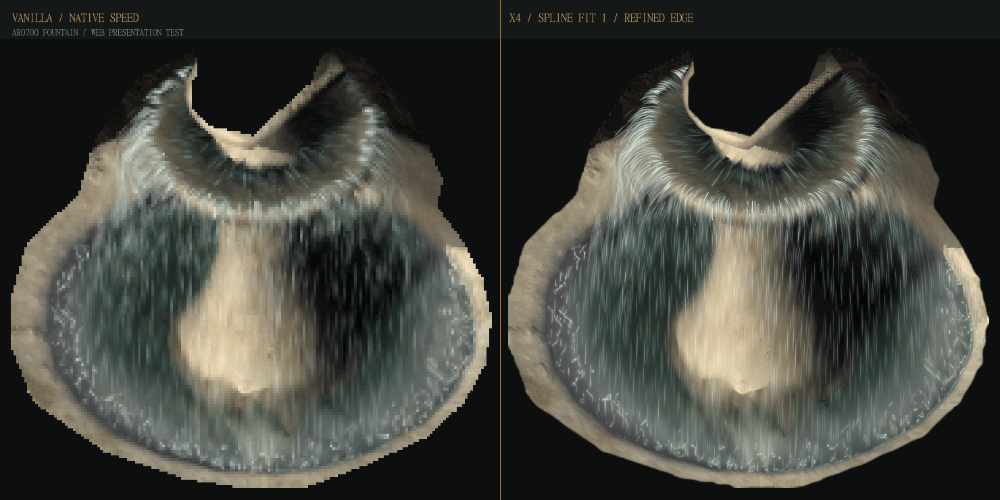

# BG2 HD Visual Project

> **Visit the project website:** [bg2hd.gaurox.dev](https://bg2hd.gaurox.dev/) — explore the [visual gallery](https://bg2hd.gaurox.dev/gallery/) and follow the [work in progress](https://bg2hd.gaurox.dev/progress/).

An unofficial, non-commercial, experimental visual project for *Baldur’s Gate II: Enhanced Edition*.

This repository is the project’s control plane: inventories, decisions, scripts, tests, engine code, and release manifests. It does not include original game resources, upscale outputs, runs, builds, or distributable archives.

Maps, animations, and effects are retained only when they remain coherent with the original rendering. Production output, in-game QA, installation, and release selection are tracked separately.

*AR0700 · Waukeen’s Promenade · focused x1 / x4 comparison.*

## Scope

| Area | Tracked content |
|---|---|
| Maps | Area inventory, recipes, selections, and x4 render QA |
| Animations | Frames, interpolation, alpha, occlusion, and per-area validation |
| Sprites | Normalized inventory and xN rendering studies; still experimental |
| Interface and graphics | Asset inventories, extraction data, and manifests |
| Engine | Windows/EEex DLL source, shaders, and runtime validation |
| Release | Manifests, installer scripts, and gates; no release is currently ready |

## Examples

*Matched in-game capture: vanilla on the left; x4 maps and treated animations on the right. Creature sprites remain native reference elements.*

  

*Sprite work is assessed separately; research output is not promoted without in-game QA.*

*AR0700 fountain: native and x4 motion study with a refined alpha contour.*

## Status

- The release manifest is `blocked`; this repository does not provide an installable mod.
- Validated selections and release integration are distinct from production output.
- The presentation website is maintained in a separate repository.

## Entry points

| Topic | Reference |
|---|---|
| Workspace rules | [AGENTS.md](AGENTS.md) |
| TIS/PVRZ maps | [pipeline/README.md](pipeline/README.md) |
| BAM animations | [animations/README.md](animations/README.md) |
| Sprites | [sprite/README.md](sprite/README.md) |
| Interface | [interface/README.md](interface/README.md) |
| Video | [video/README.md](video/README.md) |
| Engine | [engine/InfinityEngine-Enhancer/source-patchee/README.md](engine/InfinityEngine-Enhancer/source-patchee/README.md) |
| Release | [releases/BG2-HD-Upscale/README.md](releases/BG2-HD-Upscale/README.md) |

## Distribution boundaries

- Fan project; not affiliated with Beamdog or the *Baldur’s Gate* rights holders.
- Original game assets and heavy generated artifacts remain outside the repository.
- Release files may only be produced after the manifest-defined gates pass.
