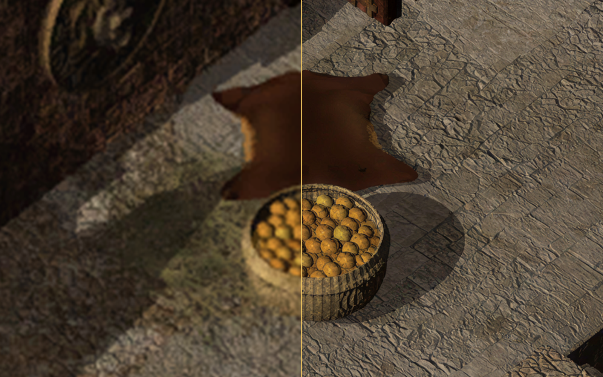
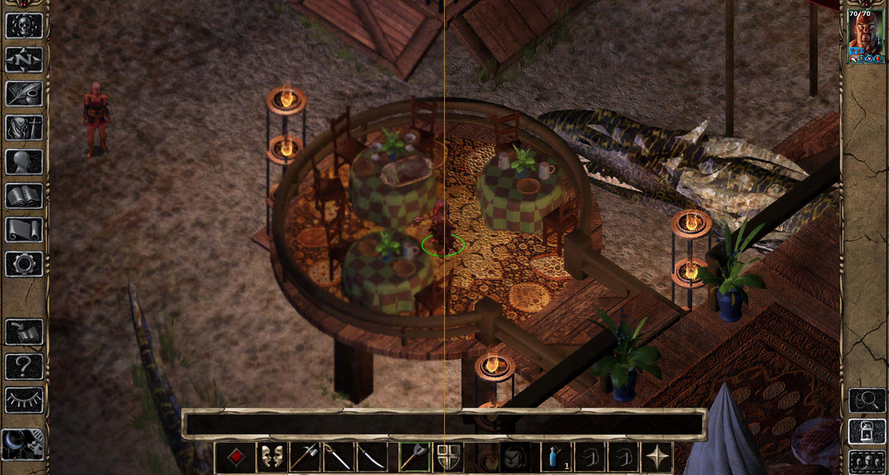
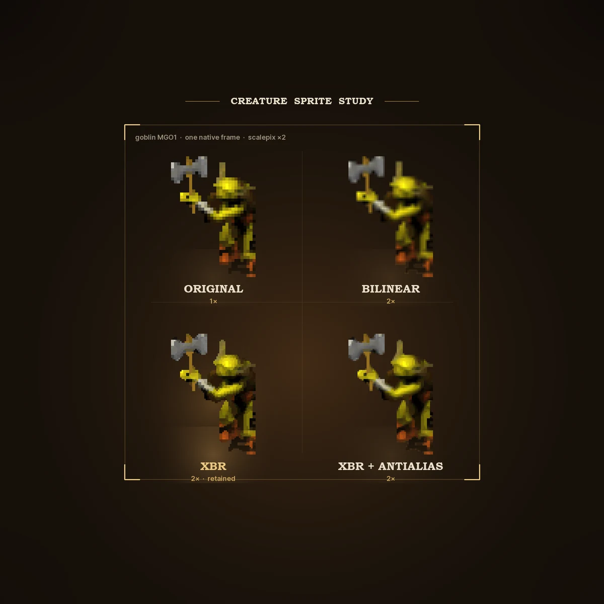
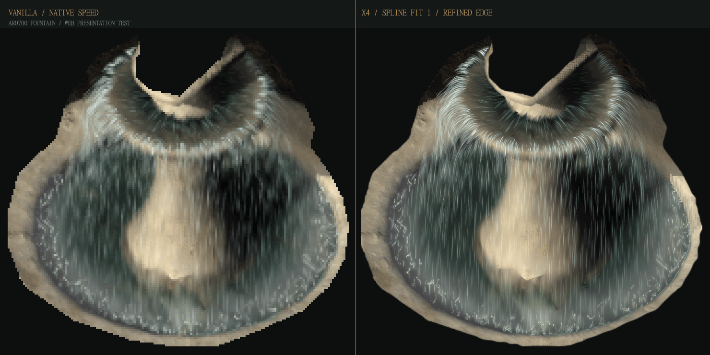

# BG2 HD Visual Project

> **Visit the project website:** [bg2hd.gaurox.dev](https://bg2hd.gaurox.dev/) — explore the [visual gallery](https://bg2hd.gaurox.dev/gallery) and follow the [work in progress](https://bg2hd.gaurox.dev/progress).

An unofficial, non-commercial, experimental visual project for *Baldur’s Gate II: Enhanced Edition*.

This repository is the project’s control plane: inventories, decisions, scripts, tests, engine code, and release manifests. Heavy production outputs remain external; selected references, comparisons and historical build inputs may be tracked and retain their own rights.

Maps, animations, and effects are retained only when they remain coherent with the original rendering. Production output, in-game QA, installation, and release selection are tracked separately.

> Règle documentaire : écrire pour des agents IA. Toute nouvelle documentation ou modification doit privilégier la densité d’information. Éviter la prose longue, le contexte narratif et les répétitions.

## Aides de travail facultatives

La production quotidienne et la finalisation sont séparées par
[`docs/PRODUCTION_RAPIDE.md`](docs/PRODUCTION_RAPIDE.md). Un asset accepté n'entraîne pas la
reconstruction des projections ou du package.

La documentation sert d'index de solutions. Aucune lecture préalable exhaustive n'est requise.
Consulter [docs/UPSCALING_WORK_PREFLIGHT.md](docs/UPSCALING_WORK_PREFLIGHT.md) ou le README d'un
domaine seulement lorsqu'un repère manque pour la tâche courante.

*AR0700 · Waukeen’s Promenade · focused x1 / x4 comparison.*

## Scope

| Area | Tracked content |
|---|---|
| Maps | Area inventory, recipes, selections, and x4 render QA |
| Animations | Frames, interpolation, alpha, occlusion, and per-area validation |
| Sprites | Validated x2 runtime with canonical xBR and derived ReboutCX catalogs |
| Interface and graphics | Asset inventories, extraction data, and manifests |
| Engine | Windows/EEex DLL source, shaders, and runtime validation |
| Release | Manifests, installer scripts, and gates; no release is currently ready |

## Examples

*Matched in-game capture: vanilla on the left; x4 maps and treated animations on the right. Creature sprites remain native reference elements.*

  

*Sprite work is assessed separately; research output is not promoted without in-game QA.*

*AR0700 fountain: native and x4 motion study with a refined alpha contour.*

## Status

- The release manifest is `blocked`; this repository does not provide an installable mod.
- Validated selections and release integration are distinct from production output.
- The public website has a separate source repository; see [docs/WEBSITE.md](docs/WEBSITE.md).

## Entry points

| Topic | Reference |
|---|---|
| Workspace rules | [AGENTS.md](AGENTS.md) |
| Decisions | [docs/DECISIONS.md](docs/DECISIONS.md) |
| Index rapide upscaling | [docs/UPSCALING_WORK_PREFLIGHT.md](docs/UPSCALING_WORK_PREFLIGHT.md) |
| Public website | [docs/WEBSITE.md](docs/WEBSITE.md) |
| TIS/PVRZ maps | [pipeline/README.md](pipeline/README.md) |
| BAM animations | [animations/README.md](animations/README.md) |
| Effects | [effects/README.md](effects/README.md) |
| Sprites | [sprite/README.md](sprite/README.md) ; inventaire : `sprite/index/` |
| Interface | [interface/README.md](interface/README.md) |
| Icônes ITM/SPL | [icons/README.md](icons/README.md) |
| Video | [video/README.md](video/README.md) |
| Engine | [engine/InfinityEngine-Enhancer/source-patchee/README.md](engine/InfinityEngine-Enhancer/source-patchee/README.md) |
| Pipeline de rendu | [docs/RENDERING_PIPELINE.md](docs/RENDERING_PIPELINE.md) |
| Release | [releases/BG2-HD-Upscale/README.md](releases/BG2-HD-Upscale/README.md) · [integration workflow](releases/BG2-HD-Upscale/docs/INSTALLER_AND_UPSCALE_WORKFLOW.md) |

## Distribution boundaries

- Fan project; not affiliated with Beamdog or the *Baldur’s Gate* rights holders.
- Game resources and their derivatives retain third-party rights, including tracked references and previews.
- Release files may only be produced after the manifest-defined gates pass.

## License and attribution

Original project code and documentation by Gaurox are available under the standard
[MIT License](LICENSE). Reuse, including commercial use and closed-source modifications, is
permitted with preservation of the copyright and permission notice.

[Third-party notices and exclusions](THIRD_PARTY_NOTICES.md) define the scope: engine upstream
code, dependencies, game assets, shaders containing native code, portraits and other third-party
material retain their respective terms. The planned non-commercial mod distribution policy
applies to the HD asset package; it does not restrict MIT code reuse.

Visible credit is appreciated, optionally as
`BG2 HD Visual Project — Gaurox — https://github.com/Gaurox/BG2-HD-Visual-Project`.
It is not an extra condition of MIT. Contributions submitted for inclusion use the applicable
file license; identify third-party material and preserve its notices.
