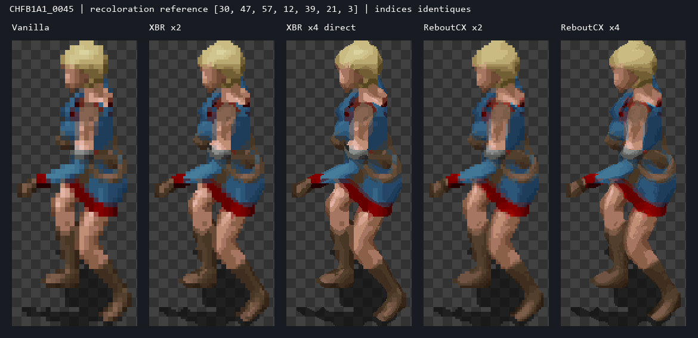
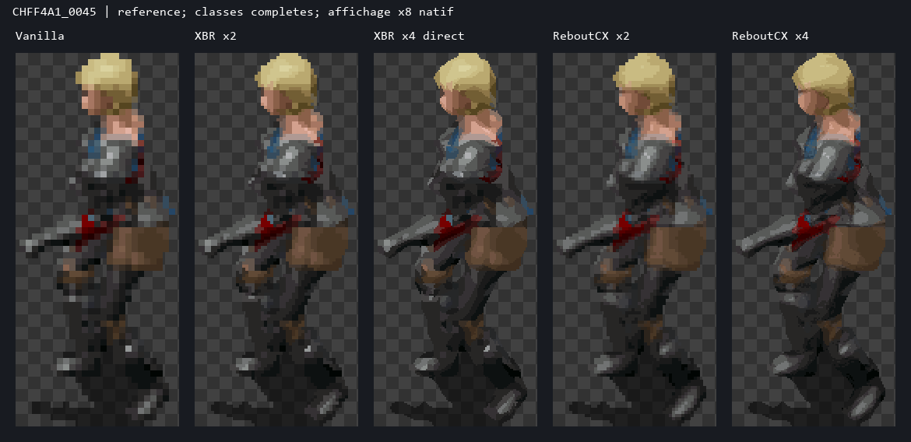
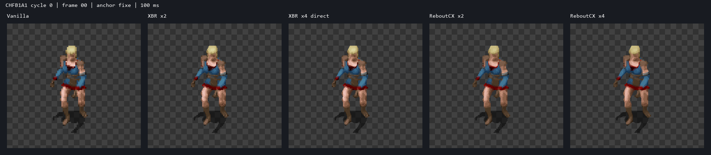
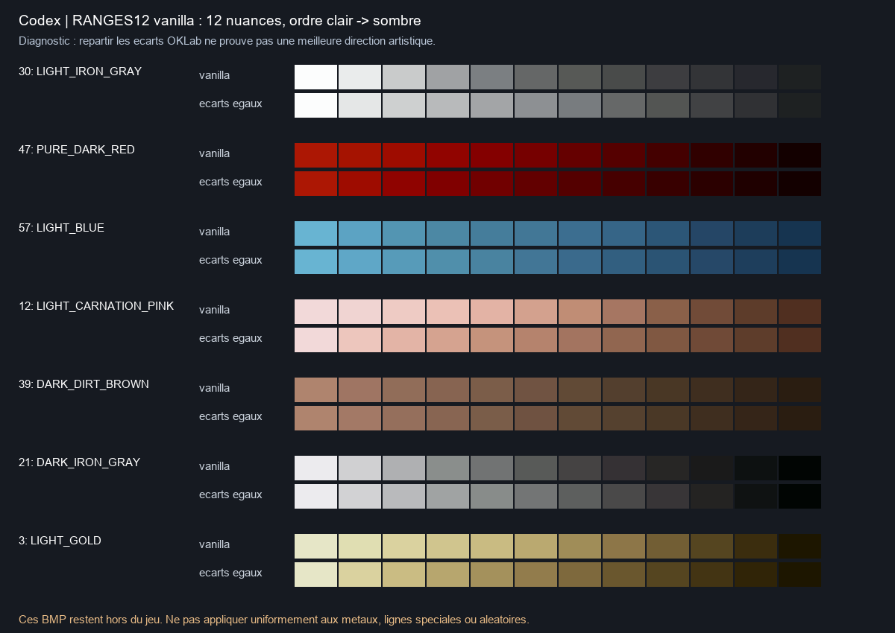
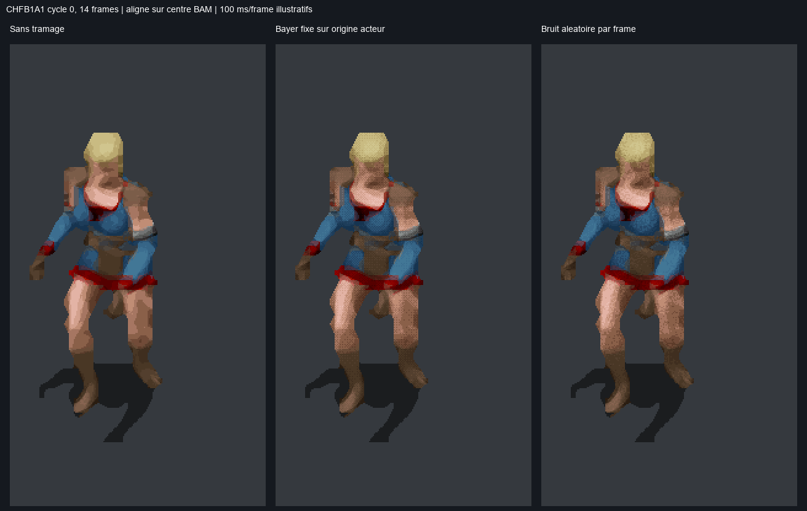
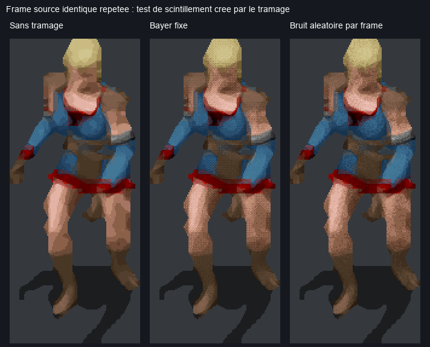

# CODEX — Femme humaine guerrière HD : guide de développement BG2EE

**Auteur : Codex · Recherche indépendante · 29 septembre 2026**  
**Cible : animation `0x6110`, BG2EE `2.7.3.0`, palettes joueur conservées.**

Ce guide est la contribution **Codex**, destinée à être comparée séparément à une recherche Claude Code. Aucun audit Claude Code n'a été lu. Travail effectué : extraction KEY/BIFF, inventaire, lecture des sources publiques et du code local, désassemblage ciblé de l'exécutable, quatre upscales réellement calculés, essais de palettisation et visuels. **Aucune installation, compilation globale, modification release ou validation en jeu.**

## 1. Décision de développement

**Recommandation : conserver les sept commandes de couleur et leurs douze nuances, mais découpler le dessin HD de sa couleur finale.** Le master doit contenir géométrie, classes de palette et modelé ; le moteur fournit les couleurs actuelles. Deux sorties complémentaires :

1. **Référence compatible :** xBR x2/x4 avec provenance des indices ; puis ReboutCX x2/x4 quantifié en OKLab **à l'intérieur de chaque classe**, sans tramage par défaut. Conserver cet étalon pour juger toute extension.
2. **Cible pour un gain visuel important :** master **ReboutCX natif x4**, indices de matériau et coordonnée de nuance séparés ; interpolation de deux nuances voisines **après capture de la palette réalisée du personnage et de sa couche**. Cette voie garde les choix du joueur et peut afficher davantage de demi-tons sans ajouter de choix de couleurs ni redéfinir tout MPALETTE. C'est un **prototype runtime à développer**, soutenu par les essais hors jeu, pas une fonctionnalité déjà validée en jeu.

Le x2 reste candidat pour la livraison : mémoire divisée par quatre face au x4, lisibilité souvent suffisante. Le x4 est le master de recherche ; son coût en jeu doit décider du format livré. Le tramage spatial est une option localisée à comparer ; le tramage changeant aléatoirement à chaque frame est écarté.

**Trois corrections d'hypothèses changent le plan :** les indices `88..255` sont déjà dynamiques ; Near Infinity n'émule pas exactement les mélanges de cette version du moteur ; le quantificateur local impose une restriction aux seuls indices présents dans la frame source, plus sévère que le contrat palette.



*Même frame `CHFB1A1:45`, même palette, même taille logique. L'agrandissement permet d'inspecter les pixels ; ce n'est pas une capture du jeu.*

## 2. Ce que le moteur fait réellement

### 2.1 Les deux niveaux d'indexation

- **Octet dans le pixel BAM** : choisit l'une des 256 entrées de palette.
- **Identifiant de couleur dans CRE/effet d'objet** : choisit une ligne de gradient dans `MPALETTE.BMP` pour un canal. Il ne choisit pas directement un indice de pixel BAM.
- **Canal** : métal, minor, major, peau, cuir, armure, cheveux, selon les conventions des assets. Ces noms ne sont pas une analyse automatique des matériaux par le moteur.

Dans la palette false-color de cette animation :

| Canal | Indices BAM | Rôle courant sur le corps |
|---:|---:|---|
| — | 0 | Transparence dans le corpus étudié |
| — | 1 | Ombre |
| — | 2–3 | Noirs réservés ; ne pas réaffecter |
| 0 | 4–15 | Métal, boucle |
| 1 | 16–27 | Couleur mineure |
| 2 | 28–39 | Couleur majeure |
| 3 | 40–51 | Peau |
| 4 | 52–63 | Cuir, sangles |
| 5 | 64–75 | Armure |
| 6 | 76–87 | Cheveux |
| Paires de canaux | 88–255 | 21 groupes de 8 mélanges, pas des RGB fixes |

`SetRange` écrit douze couleurs à partir de `4 + 12 × canal`. Les douze positions doivent garder leur signification de modelé ; trier chaque frame par luminosité détruirait cette correspondance. Les gammes courantes vont du clair au sombre, mais certaines lignes spéciales sont non monotones. Les RGB « clown » du BAM sont une visualisation du codage, pas les couleurs finalement affichées. [IESDP, opcode 7](https://gibberlings3.github.io/iesdp/opcodes/bgee.htm#op7).

### 2.2 Mélanges : formule native vérifiée

Les paires sont ordonnées `(0,1),(0,2),…,(0,6),(1,2),…,(5,6)`. Pour la paire de rang `k` et `j = 0..7` :

```text
i = 88 + 8*k + j
P[i].RGB = floor((P[4 + 12*a + j + 2].RGB
                + P[4 + 12*b + j + 2].RGB) / 2)
```

Le moteur moyenne les composantes RGB entières des **nuances 2 à 9**, avec un poids 50/50. Ce n'est ni une interpolation OKLab ni un mélange en lumière linéaire. Ces huit couleurs sont utiles à une jonction entre deux matériaux ; elles ne permettent pas des poids arbitraires 25/75 et ne prolongent pas librement une gamme isolée.

Exemple : un mélange peau/vêtement suit les deux choix. L'employer au milieu d'une joue pour gagner une nuance ferait varier le visage quand le joueur change sa tunique. Les mélanges restent une **classe sémantique à deux canaux**.

Preuve indépendante : `BaldurReal.exe`, version `2.7.3.0`, SHA256 `b51093a49140b2b8a7c046b4652bb8e535be24ebbc12b1d735e0b94217a14d57`. `SetRange` RVA `0x4221C0` ; calcul des mélanges RVA `0x421F7B`. Le loader `Baldur.exe` est un autre fichier. Les détails et instructions décodées sont dans [la note moteur Codex](engine_research.md) et [le désassemblage](engine_disassembly_codex.txt). Les offsets ne sont valides que pour ce binaire.

### 2.3 Couleurs du corps et des équipements

Chaque couche dispose de sept canaux. L'opcode 7 sélectionne la couche avec la location :

| Couche | Locations usuelles |
|---|---:|
| Corps / armure | 0–6 |
| Arme | 16–22 |
| Bouclier | 32–38 |
| Casque | 48–54 |

Ne pas assimiler automatiquement la deuxième arme à la sémantique de couleur d'un bouclier : emplacement de dessin et type d'objet sont distincts. Les effets d'ITM peuvent remplacer les couleurs héritées du CRE. La palette finale inclut aussi lumière, teintes et effets réalisés dans la palette ; d'autres états appartiennent au renderer. Pour reproduire les pixels du jeu, **capturer la palette réalisée est préférable à recalculer seulement les sept couleurs CRE**. [Décodeur de couches Near Infinity](https://github.com/NearInfinityBrowser/NearInfinity/blob/50021b834e0360c6400a6a818626b50edabdd868/src/org/infinity/resource/cre/decoder/SpriteDecoder.java#L1520).

### 2.4 Fichiers à modifier — ou à ne pas confondre

| Ressource | Rôle établi | Conséquence |
|---|---|---|
| `MPALETTE.BMP` | Gradients courts consommés par le moteur | 12 × 256, RGB24 dans cette installation ; changement global |
| `RANGES12.BMP` | Table utilisée notamment par Near Infinity | Pixels identiques à MPALETTE ici ; changer ce fichier seul ne modifie pas les sprites ingame |
| `MPAL256.BMP` | Gradients longs, notamment PLT | 256 × 256 ; ne transforme pas les douze nuances d'un BAM en 256 |
| `CLOWNCLR.IDS` | Noms des identifiants | Ce n'est ni une palette RGB ni `CLOWNCLR.2DA` |
| `RANDCOLR.2DA` | Sélections aléatoires selon le contexte | Les identifiants 200+ ne doivent pas être traités naïvement comme lignes littérales |
| `RACECOLR.2DA`, `CLASCOLR.2DA` | Couleurs par défaut race/classe | N'ajoutent pas de nuances ; extraire les valeurs effectives avant emploi |
| CRE, ITM, EFF | Choix et remplacements de couleur | Garder les identifiants et la logique native |

Le chargement de `MPALETTE` puis son passage à `SetRange` ont été vérifiés par références croisées dans le binaire, pas déduits de son nom. [RANDCOLR](https://gibberlings3.github.io/iesdp/files/2da/2da_bgee/randcolr.htm), [RACECOLR](https://gibberlings3.github.io/iesdp/files/2da/2da_bgee/racecolr.htm), [CLASCOLR](https://gibberlings3.github.io/iesdp/files/2da/2da_bgee/clascolr.htm).

### 2.5 BAM, moteur et pipeline : trois limites différentes

| Limite | Origine | Solution possible |
|---|---|---|
| 256 indices par palette, commune aux frames d'un BAM V1 | Format | Garder V1 indexé ; une autre représentation exige un autre contrat |
| Sept plages de douze + mélanges | Moteur false-color | Mieux utiliser les plages ; hook ciblé pour une représentation plus riche |
| Candidats limités aux indices déjà utilisés dans chaque frame | Quantificateur et registre HD locaux | Nouvelle version du contrat qui distingue présence source et dépendances palette |
| RGB figé en export PNG | Étape d'export | Garder indices, classe, centres, cycles et masque séparés |
| Avatar trop grand avec un BAM x4 brut | Taille logique de rendu | Texture physique x4 avec géométrie logique x1 via runtime HD |
| V2/PVRZ sans palette dynamique V1 | Format et chemin de rendu | Pas de conversion transparente ; développement dédié nécessaire |

BAM V1 : dimensions 16 bits non signées, centres 16 bits signés, nombre de frames 16 bits, nombre de cycles 8 bits. Ces plafonds de structure ne garantissent pas l'acceptation de toute taille par le moteur. V2 transporte des blocs de textures, pas une palette V1 personnalisable. Un BAM RGB ou V2 n'est donc pas à lui seul une solution aux couleurs joueur. [BAM V1](https://gibberlings3.github.io/iesdp/file_formats/ie_formats/bam_v1.htm), [BAM V2](https://gibberlings3.github.io/iesdp/file_formats/ie_formats/bam_v2.htm).

### 2.6 Near Infinity, GemRB et travaux existants

- **Near Infinity :** excellent pour les dépendances, cycles, centres, équipements et exports. Son code actuel échantillonne les mélanges avec `[0,1,3,4,6,7,9,10]`, contrairement à `[2,3,4,5,6,7,8,9]` dans le moteur local. Utiliser son aperçu comme outil d'inspection, pas comme étalon pixel exact. [Source épinglée](https://github.com/NearInfinityBrowser/NearInfinity/blob/50021b834e0360c6400a6a818626b50edabdd868/src/org/infinity/resource/cre/decoder/util/SpriteUtils.java#L666).
- **GemRB :** utile pour comprendre chargement, couches et avatars ; certaines sous-gammes sont copiées depuis un canal. Ce n'est pas le renderer BG2EE. [Implémentation](https://github.com/gemrb/gemrb/blob/5552ade1d360fc487be0450eb2a4044fc969439b/gemrb/core/CharAnimations.cpp#L2930).
- **1pp Extended palettes :** précédent pertinent pour de meilleurs choix/gradients. Ajouter des lignes ajoute des choix de couleur, pas des nuances par gamme. La table locale possède déjà 256 lignes. [Documentation 1pp](https://gwendolynefreddy.github.io/docs/spellholdstudios/images/files/extpal_readme.html).
- **Palette Generator / outils paperdoll :** utiles pour édition et aperçu ; un export RGB aplati ne conserve pas le contrat de recoloration. [Discussion avec le développeur](https://www.shsforums.net/topic/34736-naming-new-paperdolls/page-3).

## 3. Inventaire complet de la cible

### 3.1 Identification et frontière du traitement

`6110.INI`, extrait de `data/Patch2.bif` :

```ini
animation_type=6000
false_color=1
split_bams=1
armor_max_code=4
resref=CHFB
resref_armor_base=B
resref_armor_specific=F
resref_paperdoll=CHFF
height_code=WQN
height_code_helmet=WQN
height_code_shield=
```

| Niveau visuel | Corps monde | Paperdoll inventaire |
|---:|---|---|
| 1 | `CHFB1*` | `CHFF1INV` |
| 2 | `CHFB2*` | `CHFF2INV` |
| 3 | `CHFB3*` | `CHFF3INV` |
| 4 | `CHFF4*` | `CHFF4INV` |

Le niveau 4 change de préfixe. Ne pas chercher `CHFB4` comme famille finale. Les niveaux sont sélectionnés par l'apparence de l'équipement ; vérifier le code ITM, sans déduire la variante du seul nom « cuir/cotte/plate ».

**Inventaire livré : [774 BAM](assets_inventory.csv), [870 ITM apparentés](assets_inventory_items.csv), [données détaillées compressées](assets_inventory.json.gz).** Les 774 comprennent le stock de variantes de la taille concernée ; ce n'est pas l'affirmation que chaque ressource correspond à un objet actuellement équipable par une guerrière humaine. Les restrictions de kit, alignement, statistiques, objets de scénario et mains restent à résoudre à partir du contexte de test. Le CSV distingue les liens ITM et les filtres élémentaires race/classe.

| Rôle | BAM | Frames > 1 pixel, avant déduplication |
|---|---:|---:|
| Corps animé, quatre niveaux | 92 | 11 090 |
| Paperdoll corps | 4 | 9 |
| Armes main droite | 166 | 45 094 |
| Armes main gauche | 72 | 24 897 |
| Boucliers | 65 | 18 017 |
| Casques | 280 | 54 160 |
| Ailes / stock ZW | 14 | 14 |
| Paperdolls équipement WPN | 81 | 141 |
| **Total** | **774** | **153 422** |

Le compteur `>1 pixel` estime le travail, pas les frames à supprimer. Le stock contient **185 335 enregistrements de frames** ; beaucoup sont des marqueurs ou références de fragments. Les tableaux complets conservent cycles, géométrie, centres, histogrammes, indices, archive et SHA256 de chaque ressource. Sources lues dans KEY/BIFF, override exclus ; aucune certification de distribution officielle par comparaison à un dépôt externe.

Premier périmètre de production monde : **92 corps + 536 overlays** liés à des ITM de bonne catégorie autorisés par le masque humain/guerrier (166 armes principales, 72 secondaires, 60 boucliers, 238 casques), avant filtres de restrictions supplémentaires. Les 61 autres overlays sont du stock annexe : `D0` sans ITM, `H3/H4/H6` sans casque correspondant, `ZW` non équipable humain. Les 59 ITM avec apparence `H6` sont des attaques de créatures, pas des casques. Le tableau exhaustif permet de distinguer couverture utile et stock à généraliser.

### 3.2 Corps : suffixes et animation

Les quatre préfixes monde utilisent chacun 23 BAM :

```text
A1 A2 A3 A4 A5 A6 A7 A8 A9
CA G1 G11 G12 G13 G14 G15 G16 G17 G18 G19
SA SS SX
```

Il faut traiter attaques de styles différents, déplacement, repos, posture de combat, réactions/dégâts, mort/sol et gestes de lancer/tir. Garder même les séquences rarement visibles sur une guerrière : objets utilisables, multiclasses, scripts et animations de moteur peuvent les demander. La correspondance précise suffixe→séquence/cycles figure dans [la note d'inventaire](inventory_research.md) ; ne pas réduire tous les `G1*` à une seule animation.

Directions : neuf directions stockées de S à N, puis sept directions obtenues par miroir dans le décodeur de cette famille. Garder le sens des armes et la synchronisation des quatre couches. Ne pas doubler arbitrairement les ressources pour produire seize directions indépendantes.

**Piège vérifié :** plusieurs `G1/G11…G19` gardent des tables de centaines de frames avec des marqueurs 1×1, souvent d'indice 2 opaque. Ils ne sont pas des sprites transparents à supprimer. Exemples `CHFB1G11` : 846 entrées, seulement 90 frames >1 pixel ; `G1` : 54 utiles ; `G14` : 54 ; `G15` : 171. Conserver le routage des fragments et le lookup ; n'envoyer à l'upscaler que les dessins réels.

### 3.3 Armes, boucliers, casques et overlays

- Monde : `WQN<code><suffixe>`. Les variantes main gauche ajoutent `O` : `OA7/OA8/OA9/OG1`. Exemple `WQNS0A1` et `WQNS0OA7`.
- Boucliers : familles `C0..C7`, `D0..D4` présentes dans le stock ; cinq suffixes typiques `A1/A3/A5/G1/SS`.
- Casques : codes `H0..H6` et `J0..JC` présents dans le stock ; ne pas classer sur la première lettre seule (`HB` est une hallebarde). Nombreuses variantes et tous les styles de gestes.
- Armes : haches, masses, marteaux, fléaux, dagues, épées, arcs, arbalètes, frondes, bâtons, lances, hallebardes et apparences spécifiques. Le CSV relie les codes aux ITM réels ; tous les BAM partageant un code sont une unité de production visuelle.
- `ZW` : stock d'ailes recensé, largement rempli de marqueurs. `WINGS01` interdit l'usage humain ; ces ailes ne sont pas une pièce manquante à produire pour la guerrière normalement équipée.
- Paperdolls : **`WPN`**, pas `WQN` ni `WPL`, avec `INV/OIN` selon variante. Ce sont des assets supplémentaires, pas les sprites monde redimensionnés.
- Capes, effets de sort/objet, lueurs, projectiles et animations externes : suivre les effets ITM/EFF/VVC/SPL lorsqu'ils font réellement partie de l'équipement testé. Ne pas inventer une couche « cape » systématique, ni lancer un upscale de tous les effets du jeu. Le stock fixe d'avatar ne peut pas à lui seul énumérer tous les sorts futurs.

**Routage :** le corps est scindé, les overlays WQN ne le sont pas : `G1` des équipements regroupe plusieurs états. Ne pas leur appliquer le découpage `G11..G19` du corps.

**Partages :** CHFB1..3 servent aussi à l'humaine prêtresse et à des femmes demi-orques ; CHFF4 à la guerrière demi-orque. WQN et WPN servent à d'autres avatars compatibles. Modifier ces BAM globalement peut changer d'autres personnages. Pour garder ce premier cas limité à `0x6110`, router les textures HD par **animation propriétaire + couche + resref**, ou créer des ressources isolées avec un mécanisme de routage explicite. Le partage des données de génération n'autorise pas leur activation globale. [INI partageant les ressources](assets_inventory_shared_slots.json).

## 4. Comparaison réelle des quatre upscales

### 4.1 Protocole exécuté

60 frames non vides : une frame de chacun des quatre niveaux d'armure, puis 14 frames synchrones de corps, épée, petit bouclier et casque. Les planches incluent vanilla, xBR2, xBR4, Rebout2 et Rebout4 à **taille logique égale**. Les NPZ gardent cibles RGB et indices ; les essais palette n'exigent donc pas de relancer le réseau.

| Variante | Implémentation exécutée | Point à retenir |
|---|---|---|
| x2 XBR | xBRjs `xbr2x`, une passe, mélange couleur désactivé | Provenance exacte d'un pixel source ; aucune nouvelle nuance |
| x4 XBR | xBRjs `xbr4x`, une passe | Vrai x4 direct, pas deux passes x2 |
| x2 ReboutCX | Réseau natif x4, réduction Box sur float avant arrondi | Aucun modèle x2 séparé |
| x4 ReboutCX | ESRGAN RRDBNet 64nf/23nb, 16 697 987 paramètres, FP16 CUDA | RGB sans alpha, frame par frame, sans mémoire temporelle |

Poids locaux ReboutCX : SHA256 `c36a14ddb51ae094324a53b67c345da2d6b6bbf6a2249726056d5b94bdedab05`. La recette d'entraînement et sa provenance ne sont pas établies par l'inspection de ces poids. xBR : [implémentation amont](https://github.com/joseprio/xBRjs). Versions, matériel, hashes et mesures sont dans [la sous-étude upscale](upscale_research.md).

Pour ce comparatif exploitable : xBR choisit la géométrie sur les couleurs clown et transporte les indices ; Rebout traite un aperçu recoloré et récupère **alpha et classes du guide xBR de même échelle**. Ce protocole compare des pipelines, pas deux algorithmes isolés recevant exactement le même RGB. Il sépare volontairement la silhouette et la coloration. Ombre affichée à alpha 128 pour les aperçus seulement ; pas de lumière de zone simulée.

### 4.2 Résultat visuel et coût

| Critère | XBR x2 | XBR x4 | ReboutCX x2 | ReboutCX x4 |
|---|---|---|---|---|
| Silhouette | Contours améliorés, marches restantes | Courbes plus fines | Guide xBR2 conservé | Guide xBR4 conservé |
| Modelé | Teintes source réorganisées | Teintes source réorganisées | Peau/cheveux plus réguliers, petits reflets parfois lissés | Meilleure base continue, détails parfois altérés |
| Couleurs joueur | Indices natifs exacts | Idem | Classes préservées ; modelé dépend de la référence | Idem |
| Pixels physiques / source | ×4 | ×16 | ×4 | ×16 |
| Emploi conseillé | Témoin et candidat compact | Témoin spatial fin | Candidat de livraison à comparer | Master de recherche |

Les détails nouveaux du réseau ne constituent pas une reconstruction anatomique certaine. Les reflets d'armure, arêtes de lames et visages doivent rester lisibles, même si une version plus lisse paraît meilleure sur un grand agrandissement.



Planches : [niveau 1](upscale/samples/CHFB1A1_0045/compare_four.png), [niveau 2](upscale/samples/CHFB2A1_0045/compare_four.png), [niveau 3](upscale/samples/CHFB3A1_0045/compare_four.png), [niveau 4](upscale/samples/CHFF4A1_0045/compare_four.png), [épée](upscale/samples/WQNS0A1_0006/compare_four.png), [bouclier](upscale/samples/WQNC0A1_0006/compare_four.png), [casque](upscale/samples/WQNJ6A1_0006/compare_four.png).



*Cycle d'attaque, cadence comparative 100 ms par frame. Les équipements ont été évalués séparément ; cet aperçu ne valide pas l'ordre d'occlusion du moteur.*

Temps sur RTX 5090, micro-corpus de 60 frames : xBR2 ≈0,124 s, xBR4 ≈0,141 s ; chargement réseau ≈3,28 s ; inférence x4 avec dérivé x2 ≈2,61 s. Ces temps excluent plusieurs coûts d'export et de quantification ; ils ne sont pas un devis de génération de 774 BAM. Le coût runtime dépend surtout des pixels physiques, couches, uploads et invalidations de palette.

### 4.3 Exploiter toutes les nuances de la classe

Le quantificateur actuel intersecte la classe avec les indices présents dans chaque frame. En autorisant toutes ses 12 nuances, ou les 8 nuances de sa classe mixte :

| Mesure pondérée par pixels visibles, 60 frames | x2 | x4 |
|---|---:|---:|
| Erreur moyenne OKLab avec indices source uniquement | 0,021585 | 0,022329 |
| Erreur avec classe complète | 0,020319 | 0,020954 |
| Réduction | 5,86 % | 6,16 % |
| Pixels changeant d'indice | 4,21 % | 4,43 % |
| Changement de classe / masque | 0 | 0 |

Gain réel mais limité. Il faut lever la restriction **dans le producteur et dans le runtime** avant installation : le registre existant refuse un indice sans représentant source. Ne pas fabriquer de faux représentants pour contourner ce contrôle. Une validation de dépendances palette indépendante des pixels source est la bonne évolution.

### 4.4 Le risque d'une seule palette d'inférence

Trois jeux de couleurs testés, dans l'ordre métal/minor/major/peau/cuir/armure/cheveux :

```text
A = [30,47,57,12,39,21,3]
B = [30,63, 3,12,39,21,57]
C = [30,55,30, 0,39,30,0]
```

Sur le corps `CHFB1A1:45`, refaire l'inférence **ReboutCX x4** sous B ou C modifie **31,99 % / 44,39 %** des indices par rapport à la recette calculée sous A puis simplement recolorée. Sur l'armure lourde : **20,26 % / 36,28 %**. Les masques restent identiques. C'est une sensibilité du **réseau plus quantificateur** à la couleur d'entrée ; ce n'est pas une perte de la capacité technique à recolorer. Ces pourcentages n'ont pas été mesurés en x2. [Mesures](upscale/palette_sensitivity.json).

Le profil C se nomme `pale` dans certains fichiers de test, mais sa peau est sombre : le nom interne n'est pas une description de carnation.

**Conséquence :** conserver le choix de couleur ne suffit pas ; il faut aussi produire un modelé qui reste bon sous plusieurs choix. Garder un champ de nuance continu et optimiser la recette sur plusieurs palettes est plus robuste qu'une palettisation d'un unique aperçu flatteur.

## 5. Gradients, palettisation et tramage recommandés

### 5.1 Construction des douze nuances

MPALETTE et RANGES12 locaux ont exactement les mêmes pixels. Sur sept lignes représentatives, les distances entre nuances en OKLab sont irrégulières. Exemples : coefficient de variation des écarts ≈0,43 pour peau 12, ≈0,47 pour métal 30. Une redistribution à distance égale sur la courbe existante les ramène ≈0,01–0,02 dans l'expérience. **Cela mesure une régularité, pas une meilleure direction artistique.**



Recette de création :

1. Extraire la courbe RGB actuelle et convertir en OKLab/OKLCH ; préserver l'identité de la couleur, ses extrêmes et l'ordre sémantique des nuances.
2. Construire `L(t)`, `C(t)`, `h(t)` selon matière : peau avec variations modestes, tissus lisibles, métal avec zones de reflet étroites. Éviter saturation constante et blancs identiques sur toutes les matières.
3. Répartir douze échantillons selon le contraste utile **et l'histogramme des pixels de toute la séquence**, pas selon une seule frame. Un espacement perceptuel uniforme est un témoin, pas une règle imposée aux métaux.
4. Ramener dans le gamut sRGB en réduisant la chroma si nécessaire ; contrôler le RGB arrondi, les doublons, les inversions de luminosité et la lisibilité sous éclairage sombre.
5. Ne jamais renuméroter les couleurs joueur pour « nettoyer » la table. Ne pas linéariser automatiquement les lignes spéciales ni les identifiants aléatoires.

L'étude recense des lignes non monotones `197,198,199,204,212,213,221,253,255`, et des lignes à RGB répétés `74..78,222,225`. Ce sont des cas à interpréter, pas des erreurs à corriger en masse. [Métriques des 256 lignes](palette/gradient_metrics.csv). OKLab sert aux distances et à la conception ; le mélange physique de couvertures se calcule en RGB linéaire. [Définition par Björn Ottosson](https://bottosson.github.io/posts/oklab/).

**Périmètre :** une modification de MPALETTE est globale. Pour le premier personnage, tester ces gradients uniquement dans l'aperçu ou dans une copie de palette par acteur/couche gérée par le runtime. Si l'on remplace les rampes avant réalisation, garder ensuite l'ordre natif des effets et la recomposition des mélanges. Une transformation arbitraire après éclairage n'est pas équivalente.

### 5.2 Palettisation robuste

Entrées séparées par frame : `index_source`, `classe`, `masque`, `ombre`, `centre`, `cible_RGB_HD`, éventuellement `nuance_continue`.

```text
classe = 4 réservées + 7 simples + 21 paires = 32 classes
sortie(x,y) ∈ indices autorisés de classe(x,y)
alpha/ombre/spéciaux sont traités séparément
```

Version indexée recommandée : distance OKLab, candidats de la classe complète, seuils et ordre stables sur le cycle ; aucun nearest-RGB global sur 256 entrées. Version de compatibilité immédiate : même algorithme avec candidats source-used tant que le registre n'a pas évolué.

Pour rendre le résultat moins dépendant d'une palette A : calculer les cibles `T_k` sous plusieurs profils, puis chercher une recette commune :

```text
J(i) = somme_k w_k * distance_OKLab(P_k[i], T_k)^2
     + pénalités de changement temporel / de déformation d'arête

i appartient toujours à la classe sémantique autorisée
```

Même idée pour la paire `(i,j)` et un poids fixe `a` de la voie interpolée. Conserver une seule recette finale pour toutes les palettes joueur ; ne pas lancer Rebout en jeu à chaque changement de couleur. Les tests A/B/C révèlent le problème ; cette optimisation multi-profils reste à implémenter et à comparer.

Ne pas lisser aveuglément à travers les frontières. Pour améliorer une frontière en escalier, reconstruire la couverture de **ces deux matériaux identifiés**, puis comparer sous palettes très contrastées. Distinguer adoucissement de silhouette, jonction peau/tissu et variation d'éclairage dans la peau.

### 5.3 Résultat des essais de tramage

Essai exécuté sur les mêmes 60 frames × quatre bases : sans tramage, Bayer 4×4 fixe, interpolation continue entre nuances adjacentes de la même classe. Le poids de couverture est estimé en RGB linéaire ; phase Bayer ancrée sur le centre BAM, indépendante du numéro de frame. Pas d'erreur diffusée au-delà d'un masque.

| Rebout | Mode | Erreur OKLab moyenne par frame | Erreur RGB linéaire après flou σ=0,5 pixel logique |
|---|---|---:|---:|
| x2 | Sans tramage | 0,02063 | 0,01387 |
| x2 | Bayer fixe | 0,02567 | 0,01248 |
| x2 | Interpolation simulée | 0,01142 | 0,01143 |
| x4 | Sans tramage | 0,02119 | 0,01383 |
| x4 | Bayer fixe | 0,02618 | 0,01187 |
| x4 | Interpolation simulée | 0,01233 | 0,01167 |

Moyennes **par frame**, différentes des moyennes pondérées de la section 4. La cible est le RGB généré par Rebout, sans référence HD vraie. La métrique filtrée exclut un bord de masque ; elle estime l'effet de moyennage spatial, pas la qualité ingame. [CSV](palette/palette_trials.csv), [résumé](palette/palette_trials_summary.json).

Sur xBR, ces trois méthodes restent identiques : la cible est déjà exactement constituée des couleurs palette. **Le tramage seul ne crée pas de modelé absent de la cible.**


Le Bayer non atténué laisse une trame nette sur peau et cheveux, surtout à grande taille. Il réduit légèrement l'erreur après moyennage mais augmente l'erreur pixel par pixel. Par défaut : **pas de tramage**. Si une surface souffre de bandes, tester une intensité locale faible entre deux nuances proches, dans les intérieurs suffisamment larges, avec exclusion visage/yeux/arêtes/reflets fins/ombre.

### 5.4 Stabilité temporelle : ce qui est prouvé et ce qui reste ouvert

- Frame identique répétée 14 fois : Bayer fixe = 0 changement dû à la phase ; bruit renouvelé = **30,06 %** des pixels dynamiques changent d'indice en moyenne.
- Cycle réel de 14 frames, alignement par centres : sur 4 851 correspondances conservatrices (même indice guide, variation RGB cible ≤2), changements d'indice : **7,61 % Bayer fixe, 8,23 % sans tramage, 32,65 % bruit renouvelé**.
- Ces correspondances ne suivent pas la surface des membres. Elles ne prouvent pas la stabilité sur les déformations, rotations, variations de silhouette ou sur les autres séquences. Une phase fixe dans le repère de l'acteur peut encore glisser sur un bras.





Suite utile : comparer Bayer faible et masque blue-noise fixe, phase liée au repère acteur puis transportée par correspondance de mouvement **à l'intérieur des classes**, avec repli vers une phase déterministe en cas d'occlusion. Évaluer la couture du cycle et le miroir. Ne pas qualifier un bruit pseudo-aléatoire de « blue noise » sans vérifier son spectre.

Les masques spatio-temporels blue-noise publiés visent notamment des pipelines avec filtrage temporel. Leur existence ne garantit pas un bénéfice dans BG2EE sans accumulation temporelle équivalente. Ici ni blue-noise ni compensation de mouvement complète n'ont été testés. [Recherche NVIDIA](https://research.nvidia.com/publication/2022-07_spatiotemporal-blue-noise-masks).

## 6. Voies supplémentaires et usage d'EEex

### 6.1 Solutions techniquement possibles

| Voie | Gain attendu | Coût / limite | Position |
|---|---|---|---|
| Géométrie et palettisation sémantique seules | Silhouettes, modelé, usage des douze nuances | Ne change pas les RGB des gammes natives | Base nécessaire |
| Gradients MPALETTE retravaillés | Contraste, saturation, teinte plus naturels | Effet global sur d'autres ressources | Étude distincte ou palette runtime ciblée |
| Mélanges 88–255 | Transitions entre deux matières | 50/50, seulement huit couples de nuances | Employer là où les deux canaux doivent agir |
| Canal d'équipement réellement inutilisé fixé par ITM | Douze nuances constantes et mélanges avec canal variable | Changement d'ITM, partage d'assets et effets à vérifier | Option ponctuelle |
| Palette personnalisée par acteur/couche | Gradients spécifiques sans changer tout le jeu | Ordre des effets et caches sensibles | Prototype après étalon |
| Indices + poids après réalisation de palette | Demi-tons riches, recoloration préservée | Nouveau sidecar/runtime, coûts de composition | **Voie prioritaire pour fort gain** |
| Rendu truecolor/shader entièrement personnalisé | Liberté maximale | Refaire davantage de comportement moteur | Seulement si la voie précédente échoue |

Il n'existe pas 168 couleurs fixes gratuites. Pour un objet qui n'utilise que quelques canaux, un canal libre peut recevoir via opcode 7 un gradient constant. Une ancre blanche/noire peut aussi fournir des mélanges avec un canal variable. L'histogramme doit porter sur **toutes les frames, mains et objets partageant la famille**, et vérifier les effets qui recolorent déjà ce canal. Aucun canal body peau/cheveux/major/minor ne doit être sacrifié pour cette astuce.

Des overlays truecolor dédiés pourraient porter certains effets fixes, mais demanderaient un routage, une occlusion et des ancres validés ; les ajouter n'est pas un simple changement de palette.

### 6.2 Ce qu'EEex permet réellement

EEex fournit des mécanismes de patch/hook et l'accès aux objets moteur ; il n'active pas automatiquement un shader HD ni une palette étendue. Utiliser la version et l'architecture correspondant au binaire, préserver instructions et conventions d'appel. Les offsets x86 des anciens documents ne sont pas des offsets x64 utilisables. [EEex](https://github.com/Bubb13/EEex/blob/6c1f42b8184877d0222652a20c1ef89a1831db53/README.md), [mécanismes de hook](https://github.com/Bubb13/EEex/blob/6c1f42b8184877d0222652a20c1ef89a1831db53/EEex/copy/EEex_scripts/EEex_Assembly_x86-64.lua#L654).

Dans **ce dépôt**, un point de départ existe déjà en C++ :

```text
engine/InfinityEngine-Enhancer/source-patchee/src/iee/
  hooks.cpp                       réalisation palette par propriétaire/couche
  creature_sprite_x2.cpp:3957      capture_palette_snapshot : copie 256 couleurs
  creature_sprite_x2.cpp:1331      palette_fingerprint
  creature_sprite_x2.cpp:1377      visit_blend_recipes
  creature_sprite_x2.cpp:1411      apply_blend_recipes
  creature_sprite_x2.h:180         xbr_blend_pixel
pipeline/scripts/reboutcx_quantize.py
pipeline/scripts/run_creature_sprite_x2.py
```

Le format expérimental V4 possède déjà des recettes de mélange, avec poids source `1/8,1/4,1/2,3/4,7/8`. Le producteur courant exige cependant `antialias=false` et `xbr_blend=false`. **Présence de code ≠ branche activable et validée.** Il mélange les octets RGB avec sa règle alpha ; ce n'est pas l'interpolation en lumière linéaire du prototype offline.

Ne pas créer un second hook palette concurrent simplement parce qu'EEex est disponible. Étendre d'abord le point de capture/composition existant, et conserver EEex/InfinityLoader comme environnement de chargement et d'intégration. Le prototype décrit ici n'a pas modifié ce code.

### 6.3 Contrat du prototype recommandé

```text
Par pixel HD opaque : i:uint8, j:uint8, poids:uint8
Par frame : classe/provenance, masque, ombre, géométrie logique x1
Par couche courante : P[256] capturée après CVidPalette::Realize

C = sRGB_encode((1-a)*linear(P[i].RGB) + a*linear(P[j].RGB))
```

Limiter d'abord `i,j` à deux nuances adjacentes de la **même classe**. Les pixels spéciaux restent sur le chemin existant. Dans le premier prototype, interpoler seulement RGB des intérieurs opaques : ne pas introduire en même temps des silhouettes à alpha partiel dans un composite qui utilise une règle d'écrasement des pixels non transparents. Étudier ensuite les couvertures de bord et le traitement alpha/prémultiplication avec le compositing réel.

Le résultat dépend toujours de la palette courante, donc le joueur garde ses couleurs. Les douze échantillons d'entrée restent inchangés ; le nombre de RGB affichés peut dépasser 256 parce que la texture finale est RGBA. Cette distinction respecte l'intention de garder le principe des palettes dynamiques sans prétendre rester un BAM8 natif.

Conserver les identifiants de couleur ne garantit pas l'équivalence de tous les effets non linéaires ou des états hors palette. Flags, alpha, occlusions et opérations de compositing doivent rester ceux du chemin natif et être testés séparément.


Points de mise en œuvre précis :

- Versionner le sidecar ; conserver x1 dimensions/centres/cycles, resref, hash source, facteur physique et masque des entrées palette nécessaires.
- Retirer la dépendance « chaque indice généré doit avoir un pixel représentant dans la source » **pour le nouveau format**. Continuer à valider identité/géométrie de la source ; ne pas assouplir silencieusement les formats historiques.
- Le hash de palette du cache actuel parcourt les représentants source. Le nouveau cache doit inclure **toutes les entrées utilisées par les deux indices**, même absentes de la source, et tous les paramètres de rendu pertinents.
- Router par acteur/animation `0x6110`, couche et resref. Deux acteurs partageant le même BAM doivent pouvoir employer des palettes opposées sans fuite de cache.
- Copier les palettes avant traitement ; ne pas modifier une table globale partagée. Conserver les effets natifs, l'ombre, la transparence et le chemin de repli.
- À palette constante : réutiliser la texture ; après couleur/équipement/effet/lumière : invalider correctement. Mesurer coût CPU/upload et cache avant de déplacer le calcul dans un shader.
- Une mire et un rendu `i=j` doivent reproduire le chemin indexé avant d'activer `i≠j`.

Ce prototype est plus petit qu'une réécriture du renderer. Il offre un essai falsifiable : si le gain visuel reste faible au zoom réel, garder le pipeline indexé et consacrer l'effort au modelé et aux gradients.

## 7. Ordre de développement proposé

| Étape | Travail concret | Résultat qui permet de décider |
|---:|---|---|
| 1 | Reprendre le corpus et les quatre planches ; vérifier miroir, centres, classe et images de fragments | Étalon xBR et références vanilla fiables |
| 2 | Comparer palette A/B/C + extrêmes ; produire recettes classe complète, puis multi-profils | Décision de shading qui supporte la recoloration |
| 3 | Implémenter nouveau contrat de dépendances palette ; activer d'abord sortie indexée sans tramage | Gain mesuré sans changement de comportement dynamique |
| 4 | Prototype RGB interpolé intérieur, limité à CHFB1 + une épée/un bouclier/un casque | Comparaison ingame à mêmes frames, zoom et lumière |
| 5 | Choisir x2/x4 et indexé/interpolé sur qualité + mémoire ; tester gradients ciblés si bandes persistent | Une recette de référence explicitement acceptée |
| 6 | Étendre aux quatre armures, neuf directions stockées et à toutes les séquences corps | Corps complet, morts/sol compris |
| 7 | Étendre aux familles d'armes, mains, boucliers et casques ; résoudre objets/effets spécifiques | Assemblages complets et changements d'équipement corrects |
| 8 | Traiter paperdolls WPN/CHFF et les overlays effectivement nécessaires ; vérifier géométrie UI distincte, sans appliquer automatiquement le facteur monde | Cohérence monde/inventaire |
| 9 | Automatiser la recette retenue et ses contrôles ; conserver exceptions par matière/famille | Modèle réutilisable pour autres avatars |

Ne pas commencer par recalculer le stock entier avec une recette encore indécise. Aucun choix visuel de ce guide n'est déclaré « accepté ingame ». L'intégration release reste une action distincte, ultérieure et explicitement demandée.

## 8. Plan de tests en jeu

Préparer une sauvegarde et des ressources de test isolées. Fermer BG2EE et InfinityLoader avant remplacement de fichiers installés. Sauvegarder/restaurer les éléments remplacés. Comparer vanilla et candidat avec même scène, même zoom et même palette.

| Test | Variantes minimales | Détection attendue |
|---|---|---|
| Mire d'indices | 0..255 sur cible false-color | Formule des 21 mélanges, réservés, ombre, effets |
| Recoloration | Major seule, minor seule, peau, cheveux ; combinaisons noire/blanche/saturée et A/B/C | Uniquement canaux et mélanges concernés ; absence de couleur figée |
| Équipement | Quatre armures ; nu, une main, deux mains, dual wield, arc/fronde/arbalète, bouclier, casque | Bonne ressource, bonnes couleurs, bonne taille et ancre |
| Animations | Marche, attente, combat, attaques styles, tir, gestes magie/objet, dégâts, mort, sol, sommeil/chute/relevé G19 | Frames/fragments complets, cadence et raccord de boucle |
| Directions | 9 stockées +7 miroirs ; rotations continues | Main correcte, z-order corps/arme/bouclier/casque |
| Couleurs d'objet | Métaux, cuir, couleurs fixes ITM ; objet recoloré par effet | Priorité CRE/ITM/EFF conforme au natif |
| Lumière | Extérieur jour/nuit, intérieur chaud/froid, ombre | Palette et cache actualisés, pas de halo |
| Effets | Invisibilité/translucence, flou/images, teinte ou pulsation couleur, statut modifiant l'apparence | Ordre des effets conservé, pas de couche opaque aberrante |
| Occlusion | Derrière décor, murs/portes, sélection, superposition d'acteurs | Silhouettes et ordre conformes au moteur |
| Identités partagées | Deux femmes 0x6110 aux couleurs opposées ; autre avatar utilisant WQN | Aucun mélange de caches ; périmètre cible respecté |
| Transition | Changer équipement/couleur, basculer mêlée↔lancer, main gauche masquée/rétablie ; sauvegarder/recharger, voyager, reset contexte graphique | Cache correct et absence de texture périmée |
| Zoom et charge | Zoom normal/min/max, plusieurs acteurs/couches, animations simultanées | Gain visible, coût CPU/GPU/mémoire acceptable |
| Paperdoll | Chaque niveau et catégorie d'objet, main gauche/droite | Couleurs et composition cohérentes dans l'inventaire |

Pour le scintillement : vidéos courtes à cadence fixe ; comparer en lecture normale et ralentie ; mesurer l'écart après correspondance de mouvement, en excluant occlusions et changements de matière. Contrôler particulièrement cheveux, joues, lame fine et bord du bouclier. Un motif fixe ne suffit pas à conclure que les textures suivent les surfaces.

Critères d'acceptation fonctionnels : aucune perte de personnalisation, aucune fuite de classe ajoutée, aucune frame utile manquante, aucune ancre/occlusion dégradée, autres familles inchangées. Critères artistiques : amélioration visible au zoom réel et mouvement acceptable. Fixer le budget mémoire/temps de frame à partir d'une mesure vanilla/candidat sur la machine cible ; ne pas inventer un seuil universel.

## 9. Automatisation et généralisation

### 9.1 Unité de données

```text
Source: animation_id, INI, resref, BIF, SHA256, frame, cycles, centres, direction/mirroir
Sens:   layer, code_ITM, classe[H,W], indice[H,W], alpha, ombre
Master: cible_RGB_x4, champ_nuance, provenance, modèle/version/options
Sortie: facteur x2/x4, indices ou paires+poids, dépendances palette, recette versionnée
QA:     décision séparée, bytes/contrat évalués, scène et limites
```

Ne pas fusionner état source, génération, QA, installation et release. Un cache réussi n'est pas une validation visuelle. Ne pas déduire les variantes d'une autre race/sexe/classe à partir d'un simple remplacement de lettres : analyser son INI et son type d'animation.

### 9.2 Étapes automatisables

1. KEY/BIFF → graphes INI/ITM/effets, liste de ressources, doublons et partages ; inspection override séparée si l'on étudie une installation modifiée.
2. Décodage BAM → indices/centres/cycles ; repérage des marqueurs sans suppression du lookup.
3. Déduplication sur pixels **et contexte de palette/provenance**, regroupement de frames pour l'inférence ; conserver les ancres propres à chaque occurrence.
4. Production des quatre témoins demandés ; modèle x4 calculé une fois, x2 Box dérivé ; alpha/classes séparés.
5. Ensemble de profils couvrant teintes, luminances, saturations, métal/peau et contrastes intermatériaux. Échantillonnage structuré, puis tests extrêmes ; pas le produit cartésien de 256^7.
6. Optimisation palette/poids par classe ; régularisation temporelle après correspondances de mouvement ; masque d'exclusion des détails fragiles.
7. Planches à échelle commune, animations, statistiques de changement de classe, erreur multi-profils, budget pixels et cache.
8. Export de sidecar versionné ; validation locale géométrie/dépendances ; activation limitée à l'avatar choisi ; extensions par famille après décision QA.

Des décisions artistiques restent humaines : proportion des ombres/reflets, visage, texture de peau, matériaux, conservation des traits originaux, niveau de lissage et préférence au zoom réel.

### 9.3 Reproduire les essais Codex

Le dossier livré sur le Bureau est autonome pour la lecture. Les scripts de génération dépendent des sources/outils/config du dépôt et des poids locaux. Depuis `G:\AI\BG2_Upscale`, utiliser `config://chainner_python` ; exemple effectif sur ce PC :

```powershell
$studyPython = 'C:/Users/Adrien/AppData/Roaming/chaiNNer/python/python/python.exe'
& $studyPython output/codex_palette_study_20260929/upscale/run_upscale_study.py
& $studyPython output/codex_palette_study_20260929/upscale/probe_palette_sensitivity.py
& $studyPython output/codex_palette_study_20260929/palette/palette_lab.py
& $studyPython output/codex_palette_study_20260929/palette/run_palette_trials.py
```

Ces commandes produisent des essais dans le dossier de l'étude, jamais dans l'override ni la release. Pour préserver un dossier devenu preuve finale, copier les scripts vers une **nouvelle version d'étude** avant relance ; adapter leur racine dépôt et chemins de sortie. L'inventaire et le désassemblage disposent de leurs scripts propres en annexe. Les dépendances de désassemblage ne sont pas nécessaires pour lire le guide.

### 9.4 Livrables et limites à transmettre à l'agent suivant

| Fichier / répertoire | Contenu |
|---|---|
| `GUIDE_CODEX_BG2EE_FEMME_GUERRIERE.md` / `.html` | Décisions, architecture, ordre de développement et QA |
| `assets_inventory.csv`, `assets_inventory_items.csv` | Inventaires parcourables directement |
| `assets_inventory.json.gz` | Frames/cycles/centres/palettes détaillés |
| `engine_research.md`, `engine_disassembly_codex.txt` | Fonctionnement vérifié et preuves du binaire local |
| `inventory_research.md`, `upscale_research.md` | Détails de corpus et de méthode |
| `upscale/` | Comparatifs, animation, cibles NPZ, scripts, sensibilité palette |
| `palette/` | Gradients, palettisation, tramage, interpolation simulée, métriques |
| `source_reference/references.json` | Commits et hashes des sources publiques consultées |

**Établi :** structure native, formule de mélanges pour le binaire identifié, ressource moteur MPALETTE, inventaire, quatre upscales, perte de richesse par quantification, sensibilité à la palette de référence, comparaison de tramage sur le corpus.

**À développer/valider :** optimisation multi-profils, interpolation en runtime, gradients ciblés par acteur, conservation exacte des effets, composition complète équipée ingame, blue-noise/transport de motif, couverture exhaustive des mouvements et performances. La méthode proposée fournit un premier développement concret et mesurable ; elle ne transforme pas les simulations hors jeu en acceptation finale.
